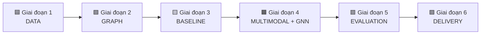

# 🔍 Multimodal Fake News Detection
## Giải thích Project cho Người Mới

> **Tài liệu này giải thích toàn bộ dự án nghiên cứu khoa học một cách đơn giản nhất, dành cho những người chưa biết gì về code.**

---

## 📌 MỤC LỤC

1. [Tổng quan: Chúng ta đang làm gì?](#-tổng-quan-chúng-ta-đang-làm-gì)
2. [Sản phẩm cuối cùng](#-sản-phẩm-cuối-cùng)
3. [Các khái niệm cần biết](#-các-khái-niệm-cần-biết)
4. [6 Giai đoạn của Project](#-6-giai-đoạn-của-project)
5. [Tài liệu tham khảo](#-tài-liệu-tham-khảo)

---

# 🎯 Tổng quan: Chúng ta đang làm gì?

## Vấn đề cần giải quyết

Tin giả (Fake News) đang lan truyền rất nhanh trên mạng xã hội. Một bài post có thể chứa:
- **Văn bản** (tiêu đề, nội dung)
- **Hình ảnh/Video** (có thể bị chỉnh sửa, cắt ghép)
- **Mạng lưới lan truyền** (ai share cho ai, ai comment gì)

**Vấn đề:** Các hệ thống hiện tại chỉ xem xét **một yếu tố** (chỉ text hoặc chỉ ảnh), nên dễ bị đánh lừa.

## Giải pháp của chúng ta

Xây dựng một hệ thống **thông minh** có khả năng:

```
┌─────────────────────────────────────────────────────────────┐
│                                                             │
│   📝 Văn bản  +  🖼️ Hình ảnh  +  🔗 Mạng lan truyền        │
│         ↓              ↓                ↓                   │
│   ┌─────────────────────────────────────────────────────┐   │
│   │           🧠 MÔ HÌNH AI KẾT HỢP                     │   │
│   │     (Multimodal + Graph Neural Network)             │   │
│   └─────────────────────────────────────────────────────┘   │
│                          ↓                                  │
│              ✅ THẬT  hoặc  ❌ GIẢ                          │
│                                                             │
└─────────────────────────────────────────────────────────────┘
```

**Điểm mạnh:** Kết hợp nhiều nguồn thông tin → Khó bị đánh lừa hơn!

---

# 🏆 Sản phẩm cuối cùng

## Chúng ta sẽ tạo ra gì?

### 1. Mô hình AI (Model)
Một chương trình máy tính có thể:
- Nhận vào: Bài post (text + ảnh + thông tin lan truyền)
- Đưa ra: Xác suất bài đó là tin giả

### 2. Bộ dữ liệu đã gán nhãn (Dataset)
- Hàng nghìn bài post đã được đánh dấu THẬT/GIẢ
- Dùng để "dạy" mô hình AI

### 3. Hệ thống hoàn chỉnh
- Code có thể chạy được
- Giao diện demo (nếu kịp)
- Báo cáo khoa học

## Ứng dụng thực tế

| Ai có thể dùng? | Dùng để làm gì? |
|-----------------|-----------------|
| Mạng xã hội (Facebook, Twitter) | Tự động đánh dấu tin nghi ngờ |
| Tổ chức báo chí | Kiểm tra nguồn tin |
| Người dùng thường | Xác minh thông tin trước khi share |

---

# 📚 Các khái niệm cần biết

## 1. Machine Learning (Học máy) 🤖

**Ví dụ đời thường:**
> Bạn xem 100 bức ảnh mèo và 100 bức ảnh chó. Sau đó bạn có thể phân biệt được mèo và chó trong ảnh mới.

**Machine Learning cũng vậy:**
- Cho máy "xem" hàng nghìn bài post (có ghi chú THẬT/GIẢ)
- Máy tự học các **đặc điểm** của tin giả
- Sau đó có thể nhận diện tin giả mới

## 2. Deep Learning (Học sâu) 🧠

Là phiên bản **nâng cao** của Machine Learning, sử dụng **Neural Network** (mạng nơ-ron).

**Ví dụ đời thường:**
> Não người có hàng tỷ nơ-ron kết nối với nhau để xử lý thông tin. Deep Learning bắt chước cấu trúc này.

```
Input → [Lớp 1] → [Lớp 2] → [Lớp 3] → ... → Output
         ↑         ↑         ↑
    Mỗi lớp học một đặc điểm khác nhau
    (từ đơn giản → phức tạp)
```

## 3. Multimodal (Đa phương thức) 🖼️📝

**"Modal"** = Một loại dữ liệu

| Modal | Ví dụ |
|-------|-------|
| Text | Tiêu đề, nội dung bài viết |
| Image | Ảnh đính kèm |
| Video | Clip đính kèm |
| Audio | Giọng nói, âm thanh |

**Multimodal** = Kết hợp **nhiều loại dữ liệu** cùng lúc

**Tại sao quan trọng?**
> Một tin giả có thể có text rất thuyết phục, nhưng ảnh lại bị photoshop. Nếu chỉ xem text → bị lừa. Nếu xem cả text + ảnh → phát hiện được!

## 4. Graph Neural Network (GNN) 🔗

### Graph là gì?

**Graph** = Một mạng lưới gồm:
- **Nodes** (điểm): Người dùng, bài post
- **Edges** (đường nối): Quan hệ giữa các điểm

```
     👤 User A
      /    \
     ↓      ↓
   📄Post  📄Post
     ↓
   👤 User B (share lại)
     ↓
   👤 User C (comment)
```

### GNN hoạt động thế nào?

**Ý tưởng chính:** Một bài post bị share bởi nhiều tài khoản "đáng ngờ" → Bài đó cũng đáng ngờ!

GNN giúp máy học được:
- Ai thường xuyên share tin giả?
- Tin giả lan truyền theo pattern nào?
- Bài nào được share bất thường?

## 5. Embeddings (Vector nhúng) 📊

**Vấn đề:** Máy tính không hiểu chữ hay ảnh, chỉ hiểu **số**.

**Giải pháp:** Chuyển văn bản/ảnh thành **dãy số** (vector).

```
"Tin giả nguy hiểm" → [0.12, -0.45, 0.89, 0.03, ...]
                       ↑
                   Dãy số đại diện cho câu này
```

**Đặc điểm hay:**
- Câu **giống nhau** → Vector **gần nhau**
- Câu **khác nhau** → Vector **xa nhau**

## 6. Transformer & BERT 📖

**Transformer** = Kiến trúc mạng nơ-ron hiện đại, rất giỏi xử lý văn bản.

**BERT** = Mô hình Transformer được Google huấn luyện trên hàng tỷ câu văn.

**Ví dụ:**
> BERT đã "đọc" gần như toàn bộ Wikipedia và sách trên Internet. Nó hiểu ngữ cảnh rất tốt.

**Chúng ta dùng BERT để:** Chuyển văn bản bài post thành vector số.

## 7. CLIP & Vision Transformer (ViT) 🖼️

Tương tự BERT, nhưng dành cho **hình ảnh**.

**CLIP** (bởi OpenAI):
- Được huấn luyện trên 400 triệu cặp (ảnh, mô tả)
- Hiểu được ảnh chứa gì
- Có thể liên kết ảnh với văn bản

**Chúng ta dùng CLIP để:** Chuyển ảnh bài post thành vector số.

## 8. Fusion (Kết hợp) 🔀

Sau khi có:
- Vector từ văn bản (BERT)
- Vector từ ảnh (CLIP)
- Vector từ đồ thị (GNN)

Cần **kết hợp** chúng lại thành một vector duy nhất.

**Các cách kết hợp:**

| Phương pháp | Mô tả |
|-------------|-------|
| Concatenation | Nối đuôi các vector lại |
| Cross-Attention | Để text "hỏi" ảnh xem có khớp không |
| Gated Fusion | Học trọng số: cái nào quan trọng hơn? |

---

# 📅 6 Giai đoạn của Project

## Sơ đồ tổng quan



---

## 🟦 GIAI ĐOẠN 1: DATA (Dữ liệu)

### Mục tiêu
Thu thập và chuẩn bị dữ liệu "sạch" để huấn luyện AI.

### Công việc chi tiết

| Task | Mô tả đơn giản | Output |
|------|----------------|--------|
| **Thu thập datasets** | Download các bộ dữ liệu tin giả có sẵn (FakeNewsNet, Fakeddit...) | Thư mục chứa file raw |
| **Làm sạch văn bản** | Xóa link, emoji, ký tự lạ; chuẩn hóa chữ | File text sạch |
| **Xử lý ảnh/video** | Resize ảnh về kích thước chuẩn; trích keyframe từ video | Folder ảnh 224x224 |
| **Data Schema** | Thiết kế cấu trúc lưu trữ dữ liệu | File JSON schema |
| **Annotation Guidelines** | Viết hướng dẫn gán nhãn cho thành viên | Tài liệu hướng dẫn |

### Tại sao quan trọng?

> **"Garbage in, garbage out"** - Nếu dữ liệu bẩn, mô hình sẽ học sai!

### Ví dụ trực quan

**TRƯỚC khi làm sạch:**
```
RT @user123: 😱😱😱 BREAKING!!! Check this out https://t.co/abc123 #fakenews #viral 🔥🔥🔥
```

**SAU khi làm sạch:**
```
breaking check this out
```

---

## 🟩 GIAI ĐOẠN 2: GRAPH CONSTRUCTION (Xây dựng đồ thị)

### Mục tiêu
Xây dựng **mạng lưới quan hệ** giữa người dùng và bài post.

### Các loại đồ thị

#### 1. Interaction Graph (Đồ thị tương tác)
```
   👤 User A ──like──> 📄 Post 1
      │                    │
   follow              comment
      ↓                    ↓
   👤 User B <──share── 👤 User C
```

#### 2. Cascade Graph (Đồ thị lan truyền)
```
   📄 Post gốc
       │
   ┌───┴───┐
   ↓       ↓
  Share1  Share2
   │       │
   ↓       ↓
 Share3  Share4
```

Cho thấy tin lan truyền như thế nào theo thời gian.

### Output
- File `edge_list.csv` chứa các cạnh (ai → ai)
- Code PyTorch để load đồ thị

---

## 🟨 GIAI ĐOẠN 3: BASELINE (Mô hình cơ sở)

### Mục tiêu
Xây dựng các mô hình **đơn giản** để làm **mốc so sánh**.

### Tại sao cần Baseline?

> Để biết mô hình phức tạp của mình có **tốt hơn** những cái đơn giản không!

### Các Baseline cần xây

| Loại | Mô hình | Mô tả |
|------|---------|-------|
| **Text only** | BERT | Chỉ dùng văn bản |
| **Image only** | ViT | Chỉ dùng hình ảnh |
| **Graph only** | GCN/GAT | Chỉ dùng đồ thị |
| **Simple Fusion** | BERT + ViT + MLP | Nối đơn giản |

### Kết quả mong đợi

Bảng như sau:

| Model | Accuracy | F1-Score |
|-------|----------|----------|
| BERT (text only) | 75% | 0.72 |
| ViT (image only) | 68% | 0.65 |
| GCN (graph only) | 70% | 0.68 |
| Simple Fusion | 78% | 0.76 |

---

## 🟧 GIAI ĐOẠN 4: MULTIMODAL + GNN (Mô hình nâng cao)

### Mục tiêu
Xây dựng mô hình **phức tạp hơn**, kết hợp thông minh hơn.

### Các công việc

#### 1. Finetune CLIP/BLIP
- **CLIP**: Học cách liên kết text và ảnh
- **BLIP**: Phiên bản mạnh hơn của CLIP

**Ví dụ CLIP hiểu:**
```
Ảnh: [Hình cún đang bơi]
Text: "Chú chó đang tắm biển"
→ CLIP biết text và ảnh KHỚP nhau!
```

#### 2. Cross-Attention Fusion
Thay vì nối đơn giản, cho text "hỏi" ảnh:
```
Text: "Có vụ nổ lớn"
       ↓ (hỏi)
Ảnh: [Hình bình thường, không có nổ]
       ↓
→ Phát hiện: Text và ảnh KHÔNG KHỚP → Có thể là tin giả!
```

#### 3. Advanced GNN (GNN nâng cao)
- **GraphSAGE**: Học cách tổng hợp thông tin từ hàng xóm
- **HGT**: Xử lý nhiều loại node khác nhau (user, post, comment)

#### 4. Propagation Modeling
Học cách tin giả lan truyền:
- Tin giả thường lan **nhanh** và **rộng** bất thường
- Tin thật lan **chậm** hơn nhưng **bền** hơn

---

## 🟥 GIAI ĐOẠN 5: EVALUATION (Đánh giá)

### Mục tiêu
Đánh giá mô hình một cách **khoa học** và **công bằng**.

### Các phương pháp đánh giá

#### 1. Ablation Study (Phân tích từng phần)

Bỏ từng thành phần để xem cái nào quan trọng:

| Cấu hình | Accuracy | Kết luận |
|----------|----------|----------|
| Full Model | 88% | Tốt nhất |
| Bỏ Image | 82% | Image góp 6% |
| Bỏ Graph | 80% | Graph góp 8% |
| Bỏ Text | 75% | Text góp 13% |

→ **Text quan trọng nhất, Graph cũng rất quan trọng!**

#### 2. Early Detection (Phát hiện sớm)
Đo độ chính xác ở **các mốc thời gian khác nhau**:
- Sau 1 giờ: 70%
- Sau 6 giờ: 80%
- Sau 24 giờ: 88%

#### 3. Visualization (Trực quan hóa)
- **Attention Heatmap**: Cho thấy mô hình "nhìn" vào đâu
- **Graph Visualization**: Vẽ mạng lưới lan truyền

---

## 🟪 GIAI ĐOẠN 6: DELIVERY (Hoàn thiện & Bàn giao)

### Mục tiêu
Đóng gói sản phẩm để người khác có thể sử dụng.

### Các sản phẩm

| Sản phẩm | Mô tả |
|----------|-------|
| **Codebase** | Toàn bộ code được tổ chức gọn gàng |
| **Model Weights** | File chứa "kiến thức" đã học của AI |
| **Demo** | Giao diện đơn giản để thử nghiệm |
| **Report** | Báo cáo khoa học chi tiết |

---

# 📖 Tài liệu tham khảo

## Học thêm về các khái niệm

| Chủ đề | Link |
|--------|------|
| Machine Learning cơ bản | [Google ML Crash Course](https://developers.google.com/machine-learning/crash-course) |
| Deep Learning | [3Blue1Brown - Neural Networks](https://www.youtube.com/playlist?list=PLZHQObOWTQDNU6R1_67000Dx_ZCJB-3pi) |
| BERT explained | [The Illustrated BERT](https://jalammar.github.io/illustrated-bert/) |
| Graph Neural Networks | [A Gentle Introduction to GNNs](https://distill.pub/2021/gnn-intro/) |
| Attention mechanism | [The Illustrated Transformer](https://jalammar.github.io/illustrated-transformer/) |
| CLIP by OpenAI | [CLIP Paper](https://openai.com/research/clip) |

## Datasets chúng ta dùng

| Dataset | Mô tả | Link |
|---------|-------|------|
| FakeNewsNet | Tin giả từ PolitiFact & GossipCop | [GitHub](https://github.com/KaiDMML/FakeNewsNet) |
| Fakeddit | 1M+ Reddit posts với nhiều loại fake | [Paper](https://arxiv.org/abs/1911.03854) |
| PHEME | Tin đồn trên Twitter | [FigShare](https://figshare.com/articles/dataset/PHEME_dataset/6392078) |

---

# ❓ FAQ (Câu hỏi thường gặp)

### Q: Tôi không biết code, tôi có thể đóng góp gì?
**A:** Rất nhiều việc không cần code:
- Gán nhãn dữ liệu (Label Studio)
- Viết tài liệu, báo cáo
- Tìm và đọc paper liên quan
- Thiết kế slide thuyết trình

### Q: Multimodal có nghĩa là phải dùng cả text lẫn ảnh?
**A:** Đúng! Multimodal = nhiều loại dữ liệu. Một bài post có thể có text, ảnh, video, metadata - chúng ta kết hợp tất cả.

### Q: GNN khác gì CNN?
**A:** 
- **CNN** (Convolutional Neural Network): Chuyên xử lý ảnh (dữ liệu dạng lưới)
- **GNN** (Graph Neural Network): Chuyên xử lý đồ thị (dữ liệu dạng mạng lưới)

### Q: Tại sao không dùng ChatGPT để phát hiện tin giả?
**A:** ChatGPT chỉ xử lý text, không xử lý được:
- Hình ảnh bị photoshop
- Mạng lưới lan truyền bất thường
- Metadata đáng ngờ

Mô hình của chúng ta kết hợp TẤT CẢ những thứ đó!

---

> **📝 Ghi chú:** Tài liệu này sẽ được cập nhật theo tiến độ project.
